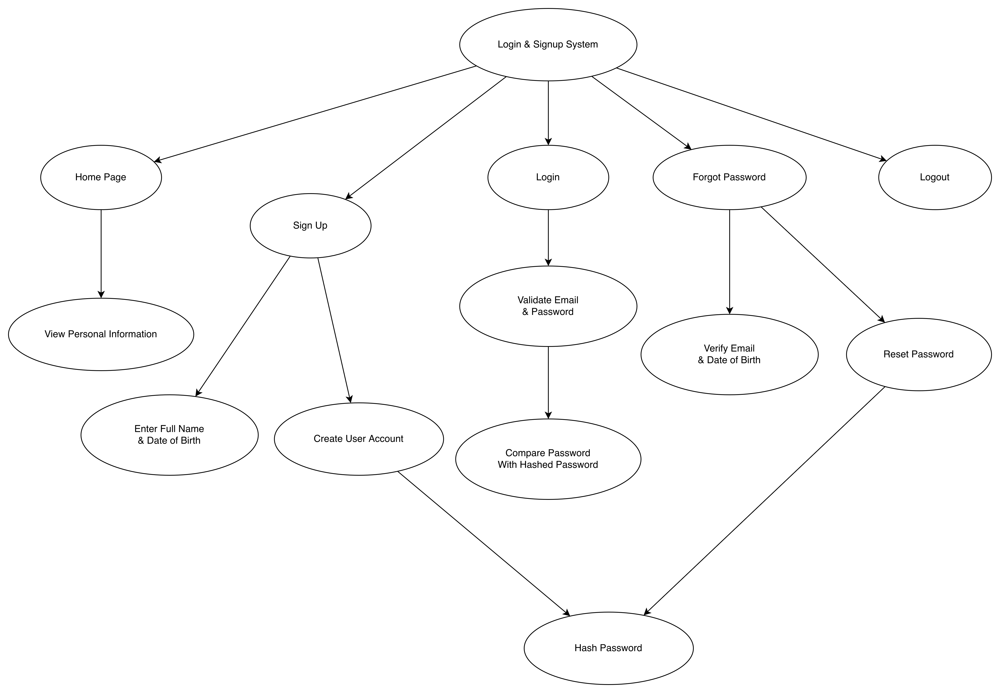

# Week10 - Activity1: Login & Signup System

This project is a command-line login and signup system for the MSE800 Week 10 Activity 1 task. It keeps the same account features as the original version, but removes the frontend pages and runs fully in the terminal.

## Core Features

- User signup
- User login
- Personal information management:
  - Full Name
  - Date of Birth
- Forgot password
- Logout
- Password hashing for secure password storage and update

## Functional Design Overview

- `Home Menu`
  Displays the main command-line menu and allows users to view personal information after login.
- `Sign Up`
  Collects the user's full name, date of birth, email, and password, then creates a new user account.
- `Login`
  Validates the user's email and password and allows access to the system after successful verification.
- `Forgot Password`
  Verifies the user's email and date of birth before allowing the password to be reset.
- `Logout`
  Ends the active session and returns the user to the login flow.
- `Hash Password`
  A shared security function used by both account creation and password reset to ensure passwords are not stored as plain text.

## Design Diagram Summary

The function design diagram breaks the system into clear project sections and related sub-functions:

- `Login & Signup System` as the main system
- `Home Page`, `Sign Up`, `Login`, `Forgot Password`, and `Logout` as the main sections
- `View Personal Information`, `Enter Full Name & Date of Birth`, `Create User Account`, `Validate Email & Password`, `Compare Password With Hashed Password`, `Verify Email & Date of Birth`, `Reset Password`, and `Hash Password` as supporting functions

This structure helps show how the system is organised at the design level without focusing too heavily on low-level code implementation.

## Example User Flow

1. Create an account with full name, date of birth, email, and password.
2. The password is hashed before being stored.
3. Log in with email and password.
4. The entered password is compared with the hashed password.
5. View personal information in the terminal after login.
6. If the password is forgotten, reset it using email and date of birth.
7. The new password is processed through the shared `Hash Password` function before update.

## Run the Program

1. Install the dependency:
   `pip install -r requirements.txt`
2. Start the program:
   `python main.py`
3. Use the terminal menu to sign up, log in, reset a password, view personal information, and log out.
