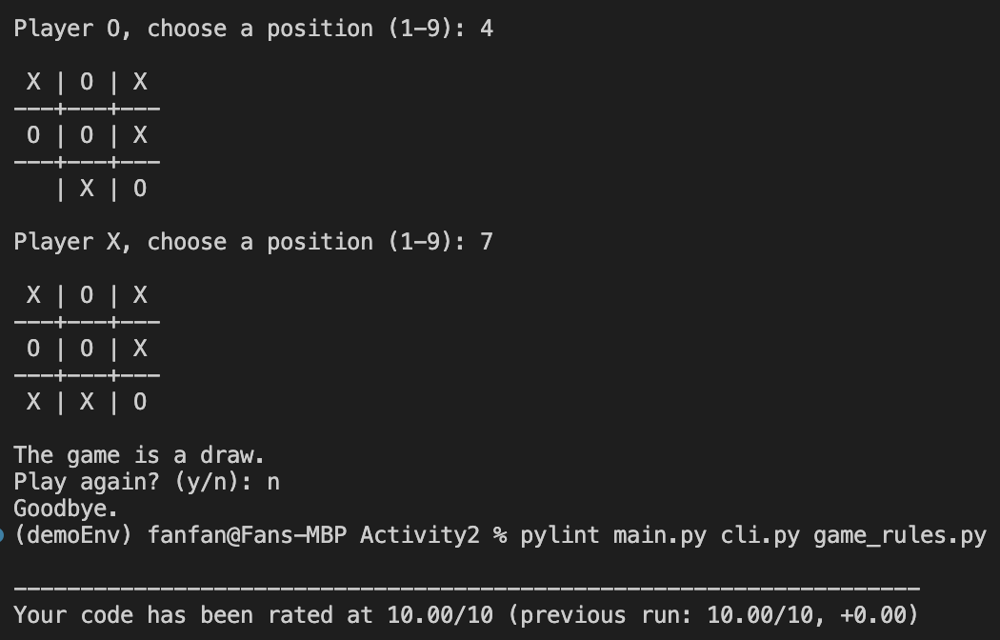

# Week10 - Activity2: Tic-tac-toe Game

This activity is a simple command-line Tic-tac-toe game for two players.

## Features

- Two-player game using `X` and `O`
- Command-line input
- Input validation
- Win detection
- Draw detection
- Replay option
- Simple functional decomposition using separate rule and CLI functions

## Program Structure

- `main.py` is the program entry point.
- `cli.py` handles user interaction, board display, and the game loop.
- `game_rules.py` handles board creation, win checking, draw checking, and player switching.

## Game Logic

- A player wins when three same symbols appear in one row, one column, or one diagonal.
- A draw happens when the board is full and no player has won.
- If there are still empty spaces and no winning line, the game continues.

## Run the Program

Run:

   ```bash
   python main.py
   ```

## Pylint Check



## Coding Style

- The code follows function-based design for readability and testing.
- The file is intended to be checked with `pylint` and general PEP8 style rules.
