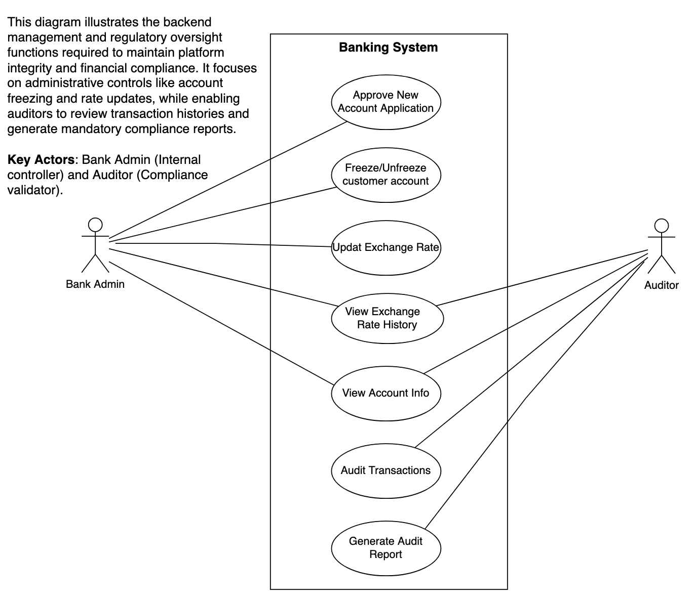

# W3-A2: Finance Money Exchange Software - Use Case Diagrams

This repository contains the Use Case Diagrams for a finance money exchange application, developed as part of the W3-A2 assignment. These diagrams are based on the core system architecture and entity relationships of a banking platform.

## 1. Banking System (Customer Operations)

**Purpose:** This diagram defines how end-users manage their financial lifecycle, from initial onboarding to executing daily fund movements.
**Key Actors:** **Customer** (Primary user) and **Bank Admin** (System overseer).
**Description:** It focuses on core services such as account opening, fund transfers, and personal transaction history tracking.

---

## 2. Banking Administrative & Audit System

**Purpose:** This diagram illustrates the backend management and regulatory oversight functions required to maintain platform integrity and financial compliance.
**Key Actors:** **Bank Admin** (Internal controller) and **Auditor** (Compliance validator).
**Description:** It focuses on administrative controls like account freezing and rate updates, while enabling auditors to review transaction histories and generate mandatory compliance reports.

