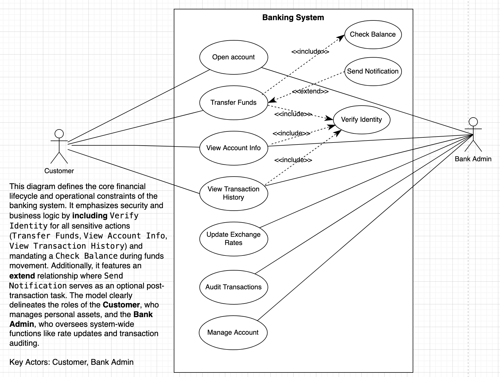
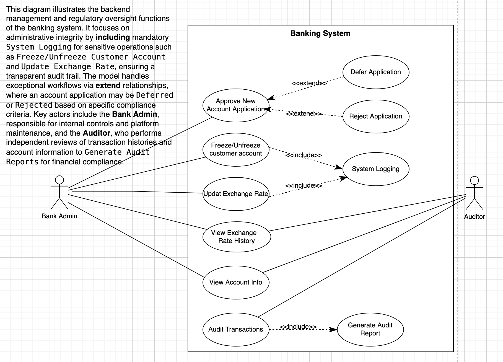

# W5-A1: Finance Money Exchange Software - Updated Use Case Diagrams

This folder contains the updated Use Case Diagrams for the finance money exchange software. The diagrams extend the earlier banking system model by clarifying both customer-facing services and administrative or audit-related processes.

## 1. Banking System

**Purpose:** This diagram describes the main banking services used in day-to-day customer operations.  
**Description:** It focuses on customer activities such as opening an account, transferring funds, viewing account information, and checking transaction history. It also shows supporting system behavior through `<<include>>` and `<<extend>>` relationships, such as identity verification, balance checking, and optional notifications after a transfer.  
**Key Actors:** **Customer** and **Bank Admin**.  

### Use Cases

1. `Open account`
2. `Transfer Funds`
3. `View Account Info`
4. `View Transaction History`
5. `Update Exchange Rates`
6. `Audit Transactions`
7. `Manage Account`
8. `Check Balance`
9. `Verify Identity`
10. `Send Notification`

### Relationships

1. **Association**
   `Customer` -> `Open account`
2. **Association**
   `Customer` -> `Transfer Funds`
3. **Association**
   `Customer` -> `View Account Info`
4. **Association**
   `Customer` -> `View Transaction History`
5. **Association**
   `Bank Admin` -> `Open account`
6. **Association**
   `Bank Admin` -> `View Account Info`
7. **Association**
   `Bank Admin` -> `Update Exchange Rates`
8. **Association**
   `Bank Admin` -> `Audit Transactions`
9. **Association**
   `Bank Admin` -> `Manage Account`
10. **`<<include>>`**
    `Transfer Funds` -> `Check Balance`
11. **`<<include>>`**
    `Open account` -> `Verify Identity`
12. **`<<include>>`**
    `View Account Info` -> `Verify Identity`
13. **`<<include>>`**
    `View Transaction History` -> `Verify Identity`
14. **`<<extend>>`**
    `Send Notification` -> `Transfer Funds`

---

## 2. Banking Administrative and Audit System

**Purpose:** This diagram illustrates the internal management and compliance functions that support the banking platform.  
**Description:** It focuses on administrative actions such as approving new account applications, updating exchange rates, freezing or unfreezing customer accounts, and reviewing exchange-rate history. It also highlights audit-related functions, including transaction auditing, viewing account information, generating audit reports, system logging, and exceptional application outcomes such as deferral or rejection.  
**Key Actors:** **Bank Admin** and **Auditor**.

### Use Cases

1. `Approve New Account Application`
2. `Freeze/Unfreeze customer account`
3. `Update Exchange Rate`
4. `View Exchange Rate History`
5. `View Account Info`
6. `Audit Transactions`
7. `Generate Audit Report`
8. `System Logging`
9. `Defer Application`
10. `Reject Application`

### Relationships

1. **Association**
   `Bank Admin` -> `Approve New Account Application`
2. **Association**
   `Bank Admin` -> `Freeze/Unfreeze customer account`
3. **Association**
   `Bank Admin` -> `Update Exchange Rate`
4. **Association**
   `Bank Admin` -> `View Exchange Rate History`
5. **Association**
   `Auditor` -> `View Exchange Rate History`
6. **Association**
   `Auditor` -> `View Account Info`
7. **Association**
   `Auditor` -> `Audit Transactions`
8. **`<<include>>`**
   `Freeze/Unfreeze customer account` -> `System Logging`
9. **`<<include>>`**
   `Update Exchange Rate` -> `System Logging`
10. **`<<include>>`**
    `Audit Transactions` -> `Generate Audit Report`
11. **`<<extend>>`**
    `Defer Application` -> `Approve New Account Application`
12. **`<<extend>>`**
    `Reject Application` -> `Approve New Account Application`

