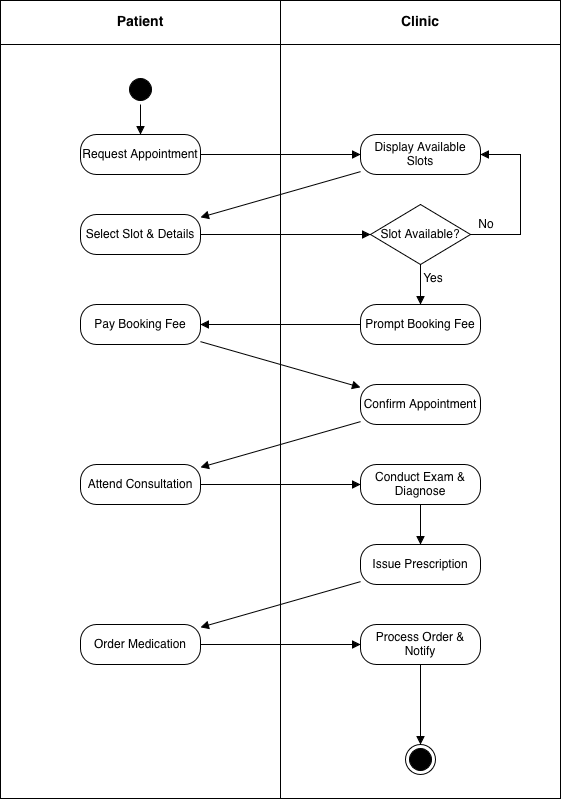

# Week 5 - Activity 3: Clinic Management System Activity Diagram

This repository contains the Activity Diagram for a clinic management system, developed as part of the Week 5 coursework. The project demonstrates the workflow of patient interactions and backend system processing.

---

## 1. Activity Diagram Overview

---

## 2. Step-by-Step Workflow Description

To provide full clarity on the system's logic, the process is divided into three distinct phases:

### Phase 1: Appointment Booking & Payment
1. **Request Appointment (Patient):** The patient initiates the process by requesting a new appointment.
2. **Display Available Slots (System):** The system retrieves and shows the current calendar of available times.
3. **Select Slot & Details (Patient):** The patient chooses a preferred time and enters their personal information.
4. **Slot Validation (System - Decision):** 
   * **If Yes (Available):** The system proceeds to prompt for the booking fee.
   * **If No (Taken):** The system loops back to "Display Available Slots" to allow a new selection.
5. **Pay Booking Fee (Patient):** The patient completes the transaction for the initial booking fee.
6. **Confirm Appointment (System):** The system verifies payment and finalizes the booking slot.

### Phase 2: Medical Consultation
7. **Attend Consultation (Patient):** The patient visits the clinic at the scheduled time.
8. **Conduct Exam & Diagnose (System/Doctor):** The doctor performs the medical examination and records the diagnosis.
9. **Issue Prescription (System/Doctor):** Based on the diagnosis, a formal medical prescription is generated in the system.

### Phase 3: Medication Fulfillment
10. **Order Medication (Patient):** The patient confirms the order for the prescribed medication.
11. **Process Order & Notify (System):** The system processes the order, manages inventory, and sends a final notification to the patient.
12. **End:** The process concludes once the patient is notified.

---

## 3. Design Note
* **Note on Workflow:** While in some regions (like New Zealand) pharmacies are separate entities, this diagram treats the medication fulfillment as an integrated service within the Clinic System to simplify the organizational scope of the project.